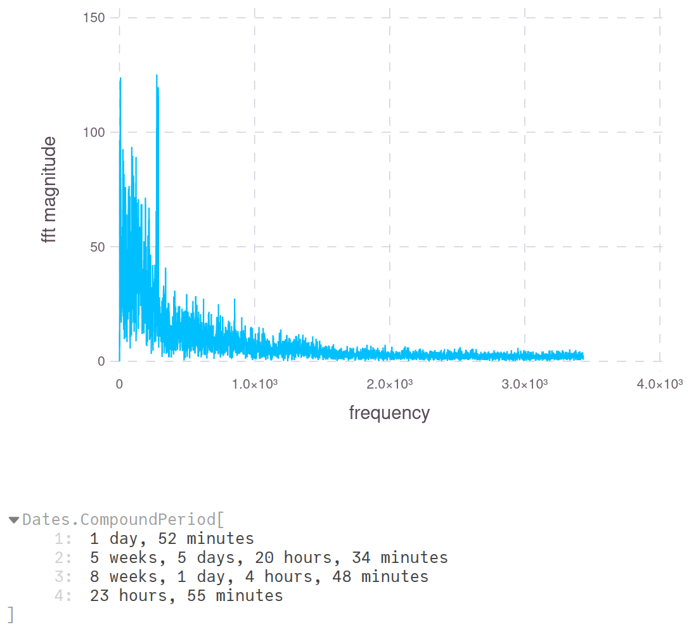

# browser-actogram

Inspired by the [online_actogram](https://github.com/barrettfdavis/online_actogram) project. Primarily supports Firefox-based browsers, for now. 

> Each column represents the 24 hours (top: 00:00, bottom: 23:00) of a single day (left: earliest, right: most recent) where the brightness of a cell corresponds to browser activity

You can use the [Pluto.jl](https://github.com/fonsp/Pluto.jl) notebook `acto_notebook.jl` to generate your own. A static version of the notebook interface with usage instructions can be found at <https://blepabyte.github.io/browser-actogram>.

## Analysis

- Experimental: Frequency analysis of activity patterns

